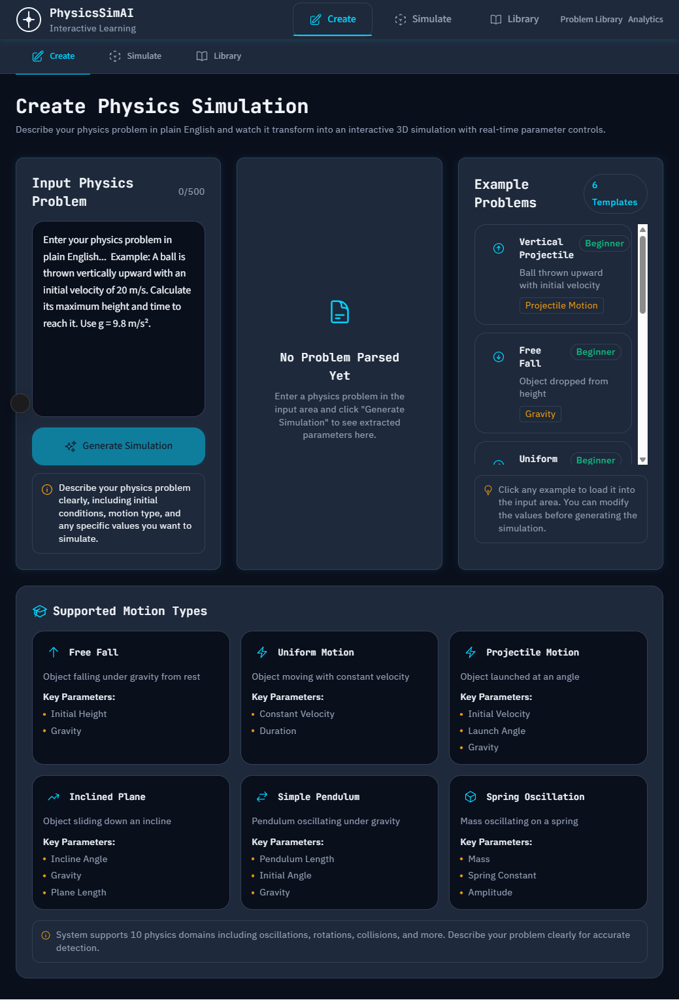
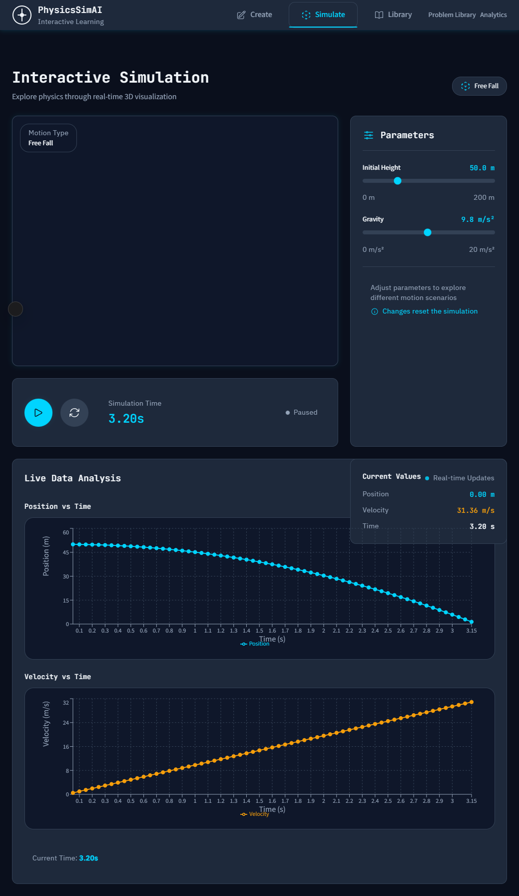
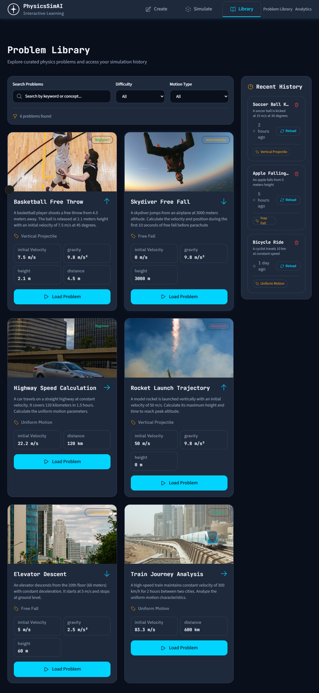

# 🚀 VIBE 2K26 – AI Physics Simulation Platform

An AI-powered interactive learning system that converts physics word problems into dynamic, real-time visual simulations.

This platform bridges the gap between textual problem statements and conceptual understanding by allowing learners to explore “what-if” scenarios through interactive visualization.

---

# 📌 Project Title

**AI-Powered Physics Word Problem to Interactive Simulation System**

---

🔗 Live Demo: [Try the AI Physics Simulator](https://physicssimai-bvyqm93.public.builtwithrocket.new)

# 🧠 Description

STEM learners often struggle to understand physics word problems because they require mental visualization of abstract concepts such as motion, forces, oscillations, and relationships.

Most traditional tools rely on static equations and text-based explanations, limiting intuitive understanding.

This project solves that problem by:

- Accepting physics word problems as natural-language input
- Using AI to extract structured parameters
- Mapping the problem to the correct physics domain
- Generating real-time interactive simulations
- Allowing parameter manipulation
- Updating live graphs instantly

Instead of memorizing formulas, learners interact directly with the physics concept.

---

# ⚙️ Tech Stack

### Frontend
- Next.js (App Router)
- TypeScript
- TailwindCSS
- React Three Fiber
- Recharts
- Zustand (State Management)

### Backend
- Next.js API Routes
- OpenAI API (for AI-based problem parsing)

### Styling
- TailwindCSS with custom theme extensions

### Deployment
- Netlify / Vercel

---

# 🧩 Supported Physics Domains

- Free Fall  
- Uniform Motion  
- Projectile Motion  
- Inclined Plane Motion  
- Simple Pendulum  
- Spring Oscillation  
- Rotational Motion  
- Circular Satellite Motion  
- Elastic Collision  
- Damped Oscillation  

All simulations are based on real physics equations and dynamic parameter control.

---

# 🏗 System Architecture

The system follows a modular, domain-based architecture.
User Input (Physics Word Problem)
          ↓
AI Parsing Layer
(Natural Language Processing)
          ↓
Structured Parameter Output (JSON)
          ↓
Domain Detection & Mapping
          ↓
Physics Engine (Modular Domains)
          ↓
Simulation Rendering Engine
          ↓
Real-Time Graph System + Controls

### Architecture Layers

**1️⃣ Input Layer**
- Accepts natural language physics problems
- Provides predefined simulation options

**2️⃣ AI Processing Layer**
- Extracts entities (velocity, angle, mass, etc.)
- Detects physics domain
- Converts unstructured text into structured JSON

**3️⃣ Domain-Based Physics Engine**
- Each physics concept implemented as a separate module
- Uses time-based mathematical simulation functions

**4️⃣ Simulation Engine**
- Renders simple visual representations (dots, arcs, lines)
- Updates position dynamically based on equations

**5️⃣ Visualization & Interaction Layer**
- Real-time parameter sliders
- Play / Pause / Reset controls
- Live graph updates (Position vs Time, Velocity vs Time)

The system maintains a single unified simulation workspace while dynamically loading different physics engines based on the problem context.

## 🖼 Demo Screenshots

### 🧠 Create Simulation Page

### 🎮 Interactive Simulation

### 📚 Problem Library

